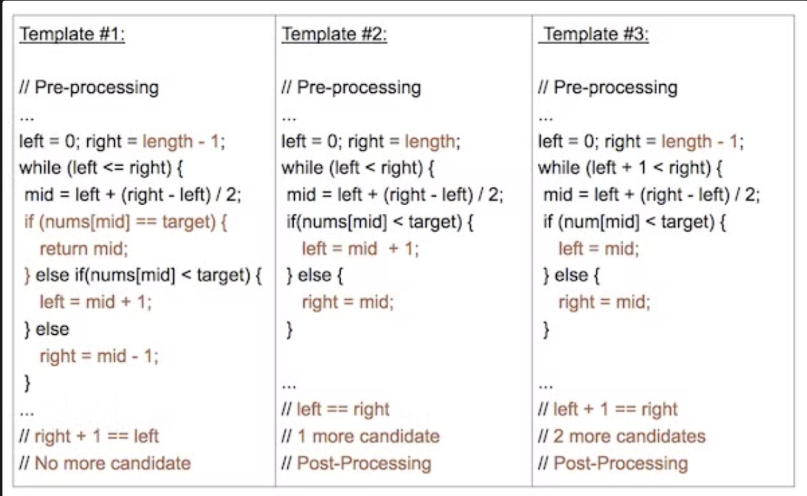
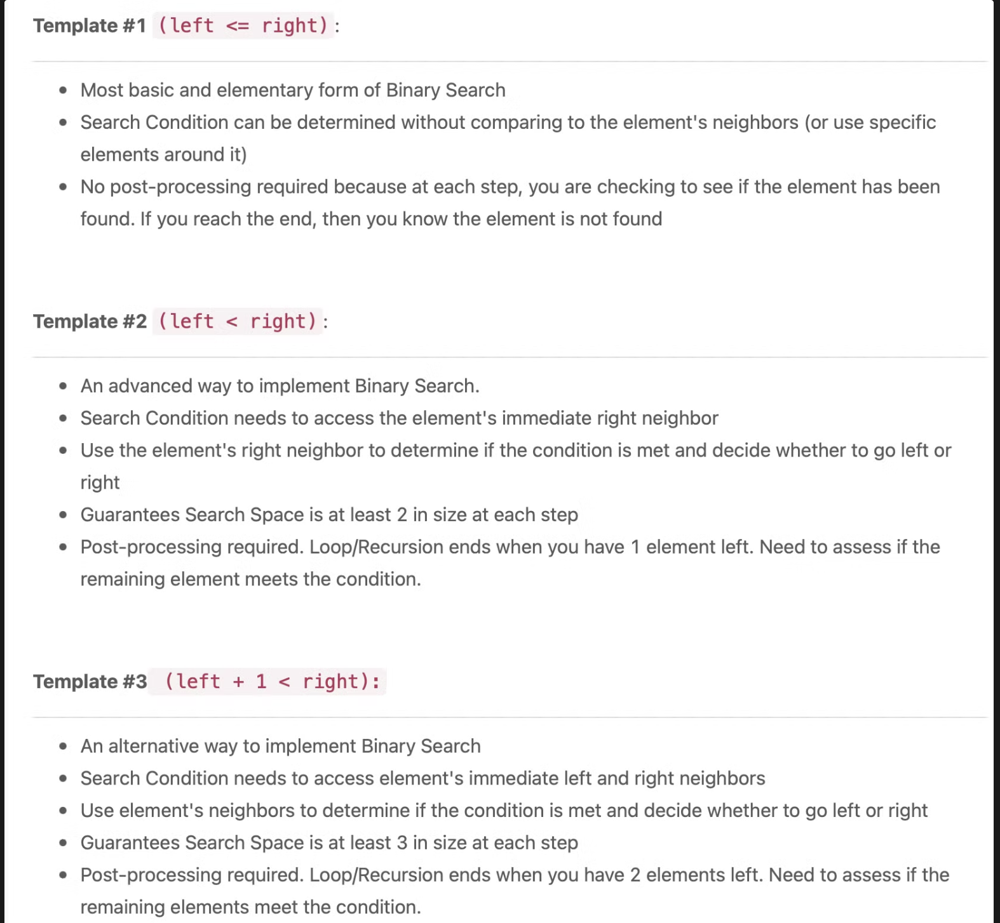
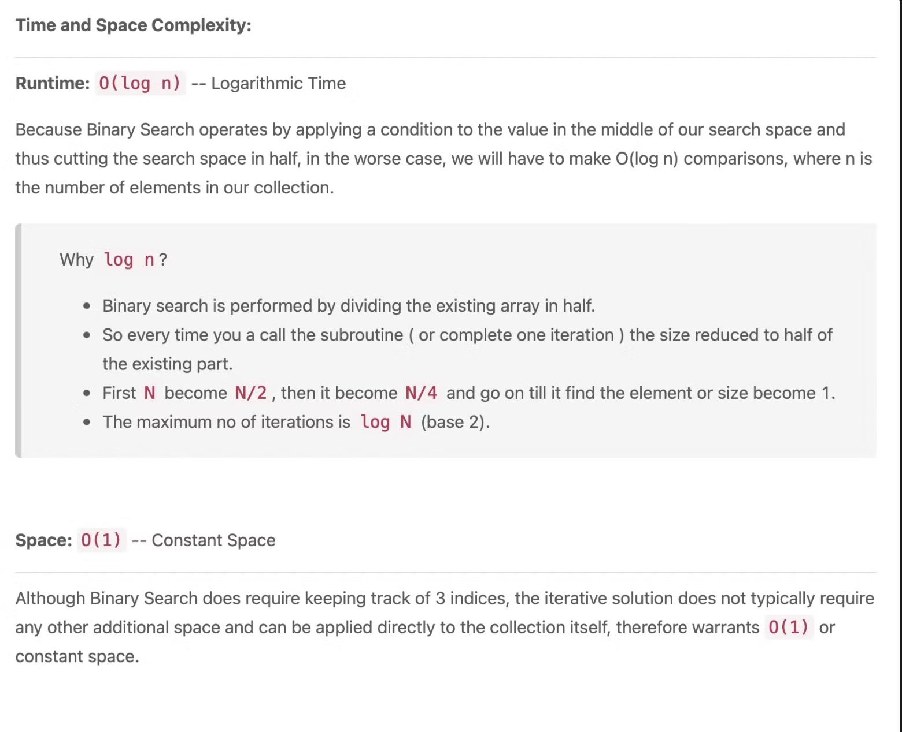

## Terminology

- Target - the value that you are searching for
- Index - the current location that you are searching
- Left, Right - the indicies from which we use to maintain our search Space
- Mid - the index that we use to apply a condition to determine if we should search left or right

> Binary Search can take many alternate forms and might not always be as straight forward as searching for a specific value. Sometimes you will have to apply a specific condition or rule to determine which side (left or right) to search next.
> 

binary search就是會透過找出左右邊界，讓他在裡面搜尋。找出中間的index去搜尋target比他高還比他低，找出來之後再找中間，以此類推。

[Binary Search 那些藏在細節裡的魔鬼（一）- 基礎介紹](https://medium.com/appworks-school/binary-search-%E9%82%A3%E4%BA%9B%E8%97%8F%E5%9C%A8%E7%B4%B0%E7%AF%80%E8%A3%A1%E7%9A%84%E9%AD%94%E9%AC%BC-%E4%B8%80-%E5%9F%BA%E7%A4%8E%E4%BB%8B%E7%B4%B9-dd2cd804aee1)

## How do we identify Binary Search

- Binary Search is an algorithm that *divides the search space in 2* after every comparison
- Binary Search should be considered every time you need to search for an index or element in a collection
- If the collection is unordered, we can always sort it first before applying Binary Search.

## 3 Parts of a SUCCESSFUL Binary Search

1. Pre-processing: Sort it if UNSORTED
2. Binary Search: Using a loop or recursion to divide search space in half after each comparison
3. Post-processing: Determine viable candidates in the remaining space.

## 3 Templates in Binary Search

### Template I

```python
def binarySearch(nums, target):
    """
    :type nums: List[int]
    :type target: int
    :rtype: int
    """
    if len(nums) == 0:
        return -1

    left, right = 0, len(nums) - 1
    while left <= right:
        mid = (left + right) // 2
        if nums[mid] == target:
            return mid
        elif nums[mid] < target:
            left = mid + 1
        else:
            right = mid - 1

    # End Condition: left > right
    return -1
```

(就是最基本的binary search algorithm)

used to search for an element or condition which can be determined by *accessing a single index* in the array

- Search Condition can be determined without comparing to the element's neighbors (or use specific elements around it)
- No post-processing required because at each step, you are checking to see if the element has been found. If you reach the end, then you know the element is not found

- Initial Condition: `left = 0, right = length-1`
- Termination: `left > right`
- Searching Left: `right = mid-1`
- Searching Right: `left = mid+1`

## Template II

> Advanced form of Binary Search
> 

It is used to search for an element or condition which requires *accessing the current index and its immediate right neighbor's index* in the array.

```python
def binarySearch(nums, target):
    """
    :type nums: List[int]
    :type target: int
    :rtype: int
    """
    if len(nums) == 0:
        return -1

    left, right = 0, len(nums)
    while left < right:
        mid = (left + right) // 2
        if nums[mid] == target:
            return mid
        elif nums[mid] < target:
            left = mid + 1
        else:
            right = mid

    # Post-processing:
    # End Condition: left == right
    if left != len(nums) and nums[left] == target:
        return left
    return -1
```

- An advanced way to implement Binary Search.
- Search Condition needs to access element's immediate right neighbor
- Use element's right neighbor to determine if condition is met and decide whether to go left or right
- Gurantees Search Space is at least 2 in size at each step
- Post-processing required. Loop/Recursion ends when you have 1 element left. Need to assess if the remaining element meets the condition.

### Distinguishing Syntax

- Initial Condition: `left = 0, right = length`
- Termination: `left == right`
- Searching Left: `right = mid`
- Searching Right: `left = mid+1`

---

## Template III

It is used to search for an element or condition which requires *accessing the current index and its immediate left and right neighbor's index* in the array.

```python
def binarySearch(nums, target):
    """
    :type nums: List[int]
    :type target: int
    :rtype: int
    """
    if len(nums) == 0:
        return -1

    left, right = 0, len(nums) - 1
    while left + 1 < right:
        mid = (left + right) // 2
        if nums[mid] == target:
            return mid
        elif nums[mid] < target:
            left = mid
        else:
            right = mid

    # Post-processing:
    # End Condition: left + 1 == right
    if nums[left] == target: return left
    if nums[right] == target: return right
    return -1
```

- An alternative way to implement Binary Search
- Search Condition needs to access element's immediate left and right neighbors
- Use element's neighbors to determine if condition is met and decide whether to go left or right
- Gurantees Search Space is at least 3 in size at each step
- Post-processing required. Loop/Recursion ends when you have 2 elements left. Need to assess if the remaining elements meet the condition.

- Initial Condition: `left = 0, right = length-1`
- Termination: `left + 1 == right`
- Searching Left: `right = mid`
- Searching Right: `left = mid`

---

## Sum up

| Name | Template  I  | Template II | Template III |
| --- | --- | --- | --- |
| Initial Condition | `left = 0, right = length-1` | `left = 0, right = length` | `left = 0, right = length-1` |
| Termination | `left > right`(`while left ≤ right`) | `left == right` (`while left < right`) | `left + 1 == right` |
| Searching Left | `right = mid-1` | `right = mid` | `right = mid` |
| Searching Right | `left = mid+1` | `left = mid+1` | `left = mid` |

---

## BS Template Analysis



大多數的問題都可以透過這三個template解決

（但我自己是覺得中間的碰到蠻多次的，再來是左邊。右邊那個我從來都沒碰過）

（但他說1,3是可以解決大部分問題的（我相信1可以啦），而中間是常用在特定情況下，我覺得好像容易用在不會再中間才找到的情況下，而是有可能可以透過偏左的搜尋中找到的情況下可以用）



