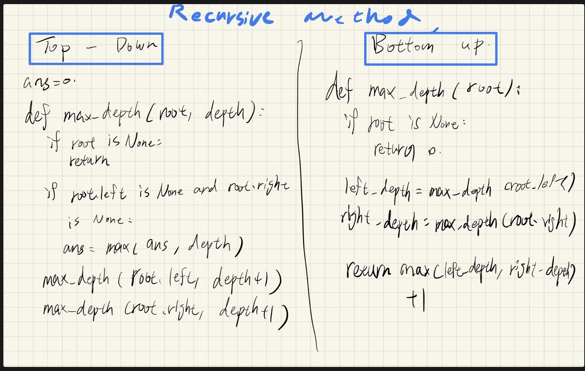

## Traverse a Tree

### Pre-order Traversal

從root至下，從左開始至右


### In-order Traversal

從左下開始，將左邊走完後回到root，再往從右邊的上面開始往右下走


> binary search tree, we can retrieve all the data in sorted order using in-order traversal
> 

### Post-order Traversal

從左邊Leaf node開始依序往上，左邊找完換右邊leaf找，最後才是root


> when you delete nodes in a tree, deletion process will be in post-order.
> 
> 
> 
> 

### Recursive or Iterative

### Level-order Traversal


Typically, we use a queue to help us to do BFS

就是一個階層的搜，樹的同個layer一次取

---

## Solve Tree Problems Recursively

### Top-down Solution

- in each recursive call, we will visit the node first to come up with some values, and pass these values to its children when calling the function recursively.
- a kind of preorder traversal

```
1. return specific value for null node
2. update the answer if needed                      // answer <-- params
3. left_ans = top_down(root.left, left_params)      // left_params <-- root.val, params
4. right_ans = top_down(root.right, right_params)   // right_params <-- root.val, params
5. return the answer if needed                      // answer <-- left_ans, right_ans

```

> given a binary tree, find its maximum depth.
> 

```
1. return if root is null
2. if root is a leaf node:
3.     answer = max(answer, depth)         // update the answer if needed
4. maximum_depth(root.left, depth + 1)     // call the function recursively for left child
5. maximum_depth(root.right, depth + 1)    // call the function recursively for right child

```

```java
private int answer; // don't forget to initialize answer before call maximum_depth
private void maximum_depth(TreeNode root, int depth) {
    if (root == null) {
        return;
    }
    if (root.left == null && root.right == null) {
        answer = Math.max(answer, depth);
    }
    maximum_depth(root.left, depth + 1);
    maximum_depth(root.right, depth + 1);
}
```

```python
answer = 0 

def maximum_depth(root, depth):
	if root is None:  # Stop recursive
		return

	if root.left is None and root.right is None:  # Touch down, update answer
		answer = max(answer, depth)

	maximum_depth(root.left, depth+1)
	maximum_depth(root.right, depth+1)
```

>💡 我覺得其實就是依照recursive往下走的時候，就一邊去計算答案

### Bottom-up Solution

- firstly call the function recursively for all the children nodes and then come up with the answer according to the returned values and the value of the current node itself
- a kind of postorder traversal

```
1. return specific value for null node
2. left_ans = bottom_up(root.left)      // call function recursively for left child
3. right_ans = bottom_up(root.right)    // call function recursively for right child
4. return answers                       // answer <-- left_ans, right_ans, root.val

```

> for a single node of the tree, what will be the maximum depth x of the subtree rooted at itself? (題目一樣，就只是先去找左最大和右最大，然後最後在選兩邊最深的)
> 

```
return 0 if root is null                 // return 0 for null node
2. left_depth = maximum_depth(root.left)
3. right_depth = maximum_depth(root.right)
4. return max(left_depth, right_depth) + 1  // return depth of the subtree rooted at root

```


> 他這裡是從下往上找的


```java
public int maximum_depth(TreeNode root) {
    if (root == null) {
        return 0;                                   // return 0 for null node
    }
    int left_depth = maximum_depth(root.left);
    int right_depth = maximum_depth(root.right);
    return Math.max(left_depth, right_depth) + 1;   // return depth of the subtree rooted at root

```

```python
def maximum_depth(root):
	if root is None:
		return 0

	left_depth = maximum_depth(root.left)
	right_depth = maximum_depth(root.right)

	return max(left_depth, right_depth) + 1
```

### 使用時機

- **Top-down**:
Can you determine some parameters to help the node know its answer? Can you use these parameters and the value of the node itself to determine what should be the parameters passed to its children?
(就是能不能用上面的資訊傳給下面來得到答案)
- **Bottom-up**:
if you know the answer of its children, can you calculate the answer of that node?
(能不能透過下面的資訊去計算答案)

